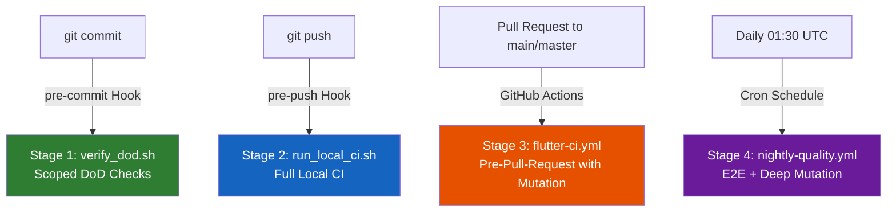

# Onboarding: Testing and Quality Strategy

> Complete guide for new developers.

---

## Table of Contents

1. [Setup (First Time)](#1-setup-first-time)
2. [Overview: Quality Pipeline Architecture](#2-overview-quality-pipeline-architecture)
3. [Stage 1: Pre-Commit (Local Commit)](#3-stage-1-pre-commit-local-commit)
4. [Stage 2: Pre-Push (Local CI)](#4-stage-2-pre-push-local-ci)
5. [Stage 3: Pre-Pull-Request (GitHub Actions - Pull Request to main/master)](#5-stage-3-pre-pull-request-github-actions)
6. [Stage 4: Nightly Quality (Scheduled Night Pipelines)](#6-stage-4-nightly-quality)
7. [Configuration Files Under `ops/testing/`](#7-configuration-files-under-opstesting)
8. [Static Analysis and Lint Rules](#8-static-analysis-and-lint-rules)
9. [Unit and Widget Tests (`test/`)](#9-unit-and-widget-tests-test)
10. [Coverage Baseline and Ratchet Mechanics](#10-coverage-baseline-and-ratchet-mechanics)
11. [Mutation Testing](#11-mutation-testing)
12. [Architecture Boundary Audit](#12-architecture-boundary-audit)
13. [Feature Test Parity](#13-feature-test-parity)
14. [Test Quality Guards](#14-test-quality-guards)
15. [Test Stability Matrix (10/10 Mode)](#15-test-stability-matrix-1010-mode)
16. [Schema Drift and Migration Verification](#16-schema-drift-and-migration-verification)
17. [Reliability Reporting](#17-reliability-reporting)
18. [E2E Test Strategy (3-Bucket Model)](#18-e2e-test-strategy-3-bucket-model)
19. [Test Exceptions](#19-test-exceptions)
20. [Summary: What do I need to keep in mind as a developer?](#20-summary)

---

## 1. Setup (First Time)

### Install Git hooks

```bash
bash ./scripts/install_git_hooks.sh
```

This sets `core.hooksPath` to `.githooks/` and enables two hooks:

| Hook | Trigger | Function |
|:---|:---|:---|
| `pre-commit` | `git commit` | Runs DoD checks on changed files |
| `pre-push` | `git push` | Runs the full local CI pipeline |

### Prerequisites

- Flutter SDK (stable channel)
- Bash-compatible shell (Git Bash on Windows, WSL, or native)
- `rg` ([ripgrep](https://github.com/BurntSushi/ripgrep)) - recommended, with fallback to `grep`
- Dart SDK (included with Flutter)

---

## 2. Overview: Quality Pipeline Architecture

Quality assurance consists of **four staged levels** that are triggered automatically on different development events:

> **Tip for VS Code:** Install the **Markdown Preview Mermaid Support** extension (`bierner.markdown-mermaid`) to render the following diagram directly in the Markdown preview. GitHub renders it correctly automatically.



| Stage | When | Duration | Scope | Mutation |
|:---|:---|:---|:---|:---|
| **Pre-Commit** | Every commit | Seconds | Changed files | No |
| **Pre-Push** | Every push | Minutes | Entire project | No (skip) |
| **Pre-Pull-Request** | PR to main | ~25 min | Entire project | Yes (stable) |
| **Nightly** | Daily 01:30 UTC | ~90 min | Entire project + E2E | Yes + E2E Explorer |

---

## 3. Stage 1: Pre-Commit (Local Commit)

**Script:** [verify_dod.sh](./scripts/verify_dod.sh)  
**Trigger:** `.githooks/pre-commit` -> automatically on `git commit`

### What happens (in order)

1. **Change detection:** Determines changed files (staged + unstaged + untracked). Pure line-ending changes are ignored.
2. **DoD relevance filter:** Only changes in `lib/**/*.dart`, `test/**/*.dart`, `ops/testing/`, relevant scripts, `.github/workflows/flutter-ci.yml`, and `.agent/rules/` trigger the following checks.
3. **Test delta check:** If production code (`lib/**/*.dart`, excluding generated files) was changed, at least one `*_test.dart` file MUST also be changed.
4. **Widget test check:** If UI files (`presentation/`, `widgets/`, `ui_kit/`) were changed, a `testWidgets()` delta MUST exist in the changed test files.
5. **Scoped E2E pathing:** E2E paths are generated in `scoped` mode (can be skipped with `SKIP_E2E_PATHING=1`).
6. **`flutter analyze`:** Static analysis of the entire project.
7. **Scoped tests with coverage:** Only tests within the change radius are executed (`flutter test --coverage --branch-coverage <affected tests>`).
8. **Scoped coverage report:** A DoD coverage report is written to `.ciReport/`.

> [!IMPORTANT]
> Mutation testing is intentionally **skipped** in pre-commit to keep commits fast.

### Bypass

```bash
SKIP_DOD=1 git commit -m "WIP"
```

---

## 4. Stage 2: Pre-Push (Local CI)

**Script:** [run_local_ci.sh](./scripts/run_local_ci.sh)  
**Trigger:** `.githooks/pre-push` -> automatically on `git push`

### Full pipeline (15 steps, ~5-10 min)

| # | Step | Script |
|:--|:---|:---|
| 1 | Verify Flutter environment | `verify_flutter_env.sh` |
| 2 | Install dependencies | `flutter pub get` |
| 3 | **Enforce architecture boundaries** | `architecture_boundary_audit.sh --fail-on-violations` |
| 4 | **Check schema drift** | `check_schema_drift.sh` |
| 5 | **Verify migrations** | `verify_migrations.sh` |
| 6 | **Static analysis** | `flutter analyze` |
| 7 | **Generate E2E pathing (full)** | `testing/e2e/scripts/generate.sh --mode full` |
| 8 | **Check feature test parity** | `verify_feature_test_parity.sh` |
| 9 | **Run tests with coverage** | `flutter test --coverage --branch-coverage` |
| 10 | **Verify coverage baseline** | `verify_coverage_baseline.sh` (with ratchet update) |
| 11 | **Generate quality baseline report** | `generate_quality_baseline_report.sh` |
| 12 | **Check test quality guards** | `verify_test_quality_guards.sh` |
| 13 | **Collect reliability metrics** | `collect_reliability_metrics.sh` |
| 14 | **Generate reliability report** | `generate_reliability_report.sh` |
| 15 | **Verify reliability report** | `verify_reliability_report.sh` |

> [!NOTE]
> Mutation is skipped in pre-push with `--skip-mutation`. DoD is suppressed via `SKIP_DOD=1` to avoid running it twice, because DoD already ran in pre-commit.

### Compact console output

The pre-push hook filters output down to the relevant progress and error lines only. The full log is stored in:

- `.ciReport/pre_push_local_ci_latest.log` (most recent run)
- `.ciReport/pre_push_local_ci_<timestamp>.log` (archive)

### Bypass

```bash
SKIP_LOCAL_CI=1 git push
```

---

## 5. Stage 3: Pre-Pull-Request (GitHub Actions)

**Workflow:** [flutter-ci.yml](./.github/workflows/flutter-ci.yml)  
**Trigger:** Pull request to `main` or `master`, plus `workflow_dispatch`

### Pipeline steps (identical to local CI + mutation)

Everything from Stage 2, **plus:**

| Additional item | Description |
|:---|:---|
| **Mutation Gate (stable)** | Blocking - must meet thresholds |
| **Mutation Gate (strict)** | Non-blocking - deeper analysis as advisory |
| **E2E pathing artifacts** | Uploaded as GitHub artifacts |
| **Adapter Budget Verification** | `verify_adapter_budget.sh --mode full` |

### Generated artifacts (as GitHub Actions artifacts)

- Quality baseline report + snapshot + risk CSV + dependency CSV
- Mutation gate reports (stable + strict)
- Reliability snapshot + report
- E2E pathing artifacts (analysis model, ground truth, journey classification, journey diff, adapter budget, etc.)

---

## 6. Stage 4: Nightly Quality

**Workflow:** [nightly-quality.yml](./.github/workflows/nightly-quality.yml)  
**Trigger:** Daily cron at 01:30 UTC + `workflow_dispatch`

### Activation condition

The workflow checks whether relevant code changes (in `lib/`, `test/`, `scripts/`, `ops/testing/`, `supabase/`, etc.) occurred within the last 24 hours. If not, all jobs are skipped.

### Jobs (parallel, only when changes exist)

| Job | Timeout | Description |
|:---|:---|:---|
| **nightly-mutation** | 45 min | Mutation testing on all targets |
| **nightly-parallel-validation-android** | 90 min | Explorer + domain tests + adapter budget on Android emulator (API 34) |
| **nightly-explorer-android** | 90 min | E2E runtime explorer on Android emulator |
| **nightly-domain-e2e-android** | 90 min | Bucket C domain tests on Android emulator (if available) |

> [!NOTE]
> All Android jobs use `reactivecircus/android-emulator-runner@v2` with API level 34, x86_64, Pixel 6 profile, and the Supabase CLI for local backend instances.

---

## 7. Configuration Files Under `ops/testing/`

All quality thresholds and scope definitions are managed centrally under [ops/testing/](./ops/testing):

| File | Purpose |
|:---|:---|
| [quality_gates.env](./ops/testing/quality_gates.env) | Thresholds: branch coverage (46.60%), mutation score (75%), high-risk mutation (85%), mutation runtime budget (360s), stability iterations |
| [coverage_baseline.env](./ops/testing/coverage_baseline.env) | Current minimum line coverage: **99.27%** (ratchet) |
| [coverage_include_patterns.txt](./ops/testing/coverage_include_patterns.txt) | Regex allow-list for coverage scope: `^lib/.*\.dart$` |
| [coverage_exclude_patterns.txt](./ops/testing/coverage_exclude_patterns.txt) | Regex deny-list: generated files (`.g.dart`, `.freezed.dart`, `.mocks.dart`, `.gen.dart`) and `lib/l10n/` |
| [mutation_targets.txt](./ops/testing/mutation_targets.txt) | File-to-test mapping for mutation testing (currently 14 targets) |
| [mutation_exclude_mutants.txt](./ops/testing/mutation_exclude_mutants.txt) | Line-specific mutation exceptions with justification |
| [feature_test_parity_baseline.txt](./ops/testing/feature_test_parity_baseline.txt) | Ratchet baseline for features without tests (currently empty = all features have tests) |
| [test_exceptions.txt](./ops/testing/test_exceptions.txt) | Structured test exceptions with type, reason, risk, owner, due date, approver |
| [test_suite_10of10.md](./ops/testing/test_suite_10of10.md) | Checklist for 10/10 quality mode |

> [!CAUTION]
> These files must NOT be changed silently. Any extension of exclude patterns, removal of include patterns, or removal of mutation targets counts as a **scope shrink** and is detected and blocked by `verify_test_quality_guards.sh`.

---

## 8. Static Analysis and Lint Rules

**Configuration:** [analysis_options.yaml](./analysis_options.yaml)

| Rule | Value | Meaning |
|:---|:---|:---|
| `avoid_print` | `true` (lint), **error** (analyzer) | `print()`, `debugPrint()`, `developer.log()` are forbidden |
| `prefer_single_quotes` | `true` | Prefer single quotes |

### Zero-print policy

Instead of `print()`, use **only** `LogService`:

```dart
LogService.feature.error('Message', error: e, stackTrace: st);
LogService.feature.info('Message');
LogService.feature.debug('Message');
```

Violations are treated as hard errors by `flutter analyze` and block all pipeline stages.

---

## 9. Unit and Widget Tests

### Directory structure

```text
test/
  config/              <- Tests for lib/config/
  core/                <- Tests for lib/core/
  features/            <- Tests for lib/features/ (1:1 feature mirror)
    auth/
    equipment/
    favors/
    feed/
    group/
    home/
    horse/
    profile/
    ride/
    task/
  shared/              <- Tests for lib/shared/
  test_helpers/        <- Shared test utilities, fakes, mocks
  tool/                <- Tests for tool/
  flutter_test_config.dart  <- Global test configuration
```

### Mandatory rules

| Rule | Description |
|:---|:---|
| **Test delta** | Every change to `lib/**/*.dart` requires a corresponding `*_test.dart` delta |
| **Widget test delta** | Changes to `presentation/` or `widgets/` require `testWidgets()` in the test delta |
| **Happy + Error + Edge** | Every behavior-relevant feature needs: happy path, error case, edge case |
| **Unit vs. Widget** | Domain/Data/Application -> unit tests; UI/Presentation -> widget tests |
| **Bug fix** | Every bug fix needs a regression test that would fail without the fix |
| **No assertion weakening** | Tests or assertions may only be removed/weakened if an equal-or-stronger replacement is delivered in the same change |
| **Arrange-Act-Assert** | Tests follow the Given-When-Then pattern |
| **Fakes > Mocks** | Prefer fakes/stubs, use mocks only when necessary |

---

## 10. Coverage Baseline and Ratchet Mechanics

**Script:** [verify_coverage_baseline.sh](./scripts/verify_coverage_baseline.sh)

### Coverage gates

| Gate | Configuration | Current value |
|:---|:---|:---|
| **Branch Coverage Baseline (Ratchet)** | `coverage_baseline.env` -> `MIN_BRANCH_COVERAGE_BASELINE_PCT` | **100.00%** |
| **Branch Coverage Gate** | `quality_gates.env` -> `MIN_BRANCH_COVERAGE_PCT` | **46.60%** |
| **Line Coverage Reference (informational)** | `coverage_baseline.env` -> `INFO_LINE_COVERAGE_PCT` | **99.27%** |

### Scope

- **Include:** All `lib/**/*.dart` (via `coverage_include_patterns.txt`)
- **Exclude:** Generated files and l10n (via `coverage_exclude_patterns.txt`)
- **Measurement:** LCOV `BRDA` for branch coverage
- **Line coverage:** Informational only, not blocking

### Ratchet forward

If measured branch coverage during pre-push is **above** the baseline, `MIN_BRANCH_COVERAGE_BASELINE_PCT` in `coverage_baseline.env` is **automatically increased**. Coverage can never go down.

### Scoped vs. full

| Context | Scope |
|:---|:---|
| Pre-Commit (`verify_dod.sh`) | Only changed production files |
| Pre-Push / CI (`run_local_ci.sh`) | Entire `lib/` |

---

## 11. Mutation Testing

**Script:** [run_mutation_gate.sh](./scripts/run_mutation_gate.sh)  
**Engine:** Custom AST-based mutation engine under `tool/mutation/ast_mutation_gate.dart`

### Configuration

| Parameter | Value |
|:---|:---|
| Minimum mutation score | **75%** |
| Minimum high-risk mutation score | **85%** |
| Max mutants per file | 4 |
| Per-mutant timeout | 45s |
| Total runtime budget | 360s |

### Two profiles

| Profile | Blocking? | Usage |
|:---|:---|:---|
| **stable** | Yes | CI gate, pre-push (when not skipped) |
| **strict** | No (`--no-threshold-fail`) | Advisory deep analysis |

### Targets

Defined in [mutation_targets.txt](./ops/testing/mutation_targets.txt) - currently 14 files with assigned tests. Format:

```text
source_file|test_command
lib/features/group/data/group_repository.dart|./scripts/flutterw.sh test test/features/group/data/group_repository_test.dart
```

### Exceptions

Line-specific exceptions in [mutation_exclude_mutants.txt](./ops/testing/mutation_exclude_mutants.txt) with format:

```text
source_file|line|reason
```

Each exception needs a **concrete technical justification** (for example platform-only branch, mathematical equivalence).

---

## 12. Architecture Boundary Audit

**Script:** [architecture_boundary_audit.sh](./scripts/architecture_boundary_audit.sh)

### What is checked

- All `import 'package:<appPackageName>/features/...'` statements are scanned
- Imports between features are only allowed through the **public API** -> `package:appPackageName/features/<feature>/<feature>.dart`
- Internal feature imports from outside -> **violation**
- Non-feature code (core, shared, config) importing internal feature files -> **violation**

### Violation categories

| Category | Meaning |
|:---|:---|
| `cross_feature_internal_import` | Feature A imports an internal module from Feature B |
| `non_feature_internal_import` | Shared/Core/Config imports an internal feature module |

### When it runs

- Pre-Push (local): `--fail-on-violations`
- Pre-Pull-Request: `--fail-on-violations`

-> **Every architecture violation breaks the pipeline.**

---

## 13. Feature Test Parity

**Script:** [verify_feature_test_parity.sh](./scripts/verify_feature_test_parity.sh)

### Rule

Every feature under `lib/features/<name>/` **must** have at least one `*_test.dart` file under `test/features/<name>/`.

### Ratchet baseline

[feature_test_parity_baseline.txt](./ops/testing/feature_test_parity_baseline.txt) allows temporary exceptions. The file is currently empty => **all features have tests**.

### Rules

- New features without tests -> error (unless listed in the baseline)
- Baseline entry for a feature that now has tests -> error (entry must be removed)
- Baseline entry for an unknown feature -> error

---

## 14. Test Quality Guards

**Script:** [verify_test_quality_guards.sh](./scripts/verify_test_quality_guards.sh) (597 lines)

This is the most extensive validation script and monitors the **integrity of the quality scope**:

### Detailed checks

| Guard | Checks |
|:---|:---|
| **Test delta** | Production Dart changes require test file changes |
| **Widget test delta** | UI code changes require a `testWidgets()` delta |
| **UI scope admission** | Changed UI files outside the coverage scope require direct file-level widget tests |
| **Coverage include shrink** | Removal of include patterns is detected |
| **Coverage include global** | The pattern `^lib/.*\.dart$` MUST exist |
| **Coverage exclude non-technical** | Only technical excludes allowed (generated files + l10n) |
| **Coverage exclude added** | New exclude patterns are reported as scope shrink |
| **Mutation target removed** | Removal from mutation targets is reported as scope shrink |
| **Mutation exclude added** | New mutation exceptions are reported as scope shrink |
| **Test exception additions** | New entries in `test_exceptions.txt` require `--exceptions-approved-by` |
| **High-risk mutation parity** | High-risk modules must be present in mutation targets |

### Scope shrink = error

Any change that silently **reduces** the quality scope is treated as an error and breaks the pipeline.

---

## 15. Test Stability Matrix (10/10 Mode)

**Script:** [run_test_stability_matrix.sh](./scripts/run_test_stability_matrix.sh)

### Purpose

Detects **flaky tests** through repeated execution with different concurrency levels and randomized test order.

### Activation

```bash
bash ./scripts/run_local_ci.sh --ten-of-ten --skip-mutation
```

### What happens

1. Tests are run **N times** (default: 2, configurable via `MIN_STABILITY_ITERATIONS` in `quality_gates.env`)
2. Each run gets a **random ordering seed**
3. Every concurrency level from `TEN_OF_TEN_CONCURRENCY_LIST` is tested (default: `auto`)
4. `verify_test_output_clean.sh` checks for warning noise in each run
5. Any single failure aborts the matrix

### 10/10 checklist

Defined in [test_suite_10of10.md](./ops/testing/test_suite_10of10.md):

1. Scoped branch coverage exactly `100.00%` (BRDA)
2. No runtime warning noise
3. No unapproved TEST_EXCEPTION
4. Mutation gates pass (stable + strict)
5. Stability matrix passes without errors

---

## 16. Schema Drift and Migration Verification

### Schema drift check

**Script:** [check_schema_drift.sh](./scripts/check_schema_drift.sh)

| Rule | Meaning |
|:---|:---|
| Migrations changed -> `schema.sql` MUST be updated | Prevents drift between migrations and schema dump |
| `schema.sql` changed without migration -> error | No manual schema changes |
| `schema.sql` empty -> error | Prevents accidental clearing |

### Migration verification

**Script:** [verify_migrations.sh](./scripts/verify_migrations.sh)

| Check | Error level |
|:---|:---|
| Deleted/renamed migrations -> **immutability violated** | Error |
| Lexicographical ordering | Error |
| Duplicate timestamp prefixes | Error |
| Filename not `YYYYMMDDHHMMSS_name.sql` | Error |
| `DROP TABLE` outside `*_contract.sql` | Error |
| `DROP COLUMN` outside `*_contract.sql` | Error |
| `TRUNCATE` outside `*_contract.sql` | Error |
| Broad GRANT ALL ON FUNCTION to anon/authenticated | Error |
| `CREATE INDEX` without `IF NOT EXISTS` | Warning |
| Mixed DDL+DML without transaction markers | Warning |

---

## 17. Reliability Reporting

The pipeline collects reliability metrics **after every CI run**:

| Script | Function |
|:---|:---|
| `collect_reliability_metrics.sh` | Collects metrics (test results, timings, etc.) |
| `generate_reliability_report.sh` | Creates a readable Markdown report |
| `verify_reliability_report.sh` | Verifies the report for consistency |

All reports are written to `.ciReport/` with timestamps:

- `reliability_snapshot_<ts>.env`
- `reliability_operational_report_<ts>.md`

---

## 18. E2E Test Strategy (3-Bucket Model)

**Directory:** [testing/e2e/](./testing/e2e)  
**Framework:** Patrol for real Android/iOS tests against a local Supabase instance

### 3-bucket classification

| Bucket | Name | Approach | Where |
|:---|:---|:---|:---|
| **A** | Generic journeys | Detected automatically via AST inference, executed through the generic explorer | `patrol_test/explorer/**` |
| **B** | Adapter-assisted journeys | Generic explorer with project-specific adapter logic (login, seed, permissions) | `testing/e2e/framework/adapter/` |
| **C** | Domain-specific tests | Journeys that cannot be validated generically at the business level, expressed as explicit Patrol tests | `patrol_test/domain_tests/**` |

### Core E2E scripts

| Script | Purpose |
|:---|:---|
| `generate.sh` | AST inference: creates a journey model from code (`--mode scoped` or `--mode full`) |
| `run_exploration.sh` | Runtime explorer on a real emulator |
| `run_domain_tests.sh` | Bucket C Patrol domain tests |
| `run_journey_diff.sh` | Compare ground truth vs. explorer results |
| `run_parallel_validation.sh` | Explorer + domain tests + adapter budget in parallel |
| `run_local_supabase.sh` | Patrol tests against local Supabase (with Android preflight cleanup) |
| `verify_adapter_budget.sh` | Checks adapter code budget |
| `verify_journey_coverage.sh` | Coverage gate for discovered executable journeys |
| `verify_runtime_budget.sh` | Runtime budget check for test runs |
| `extract_failed_tests.dart` | Extracts failure summaries from JUnit/logs |

### Generated artifacts

All reports are written to `.ciReport/e2e_pathing/`:

- `analysis_model_<mode>.json` - AST analysis model
- `ground_truth_<mode>.json` - Expected journeys
- `journey_classification_<mode>.json` - Bucket classification
- `journey_diff_<mode>.md` - Diff ground truth vs. explorer
- `adapter_budget_<mode>.md/json` - Adapter code budget
- `exploration_result_<mode>.json` - Explorer results
- `coverage_gap_<mode>.json` - Coverage gaps
- `exploration_summary_<mode>.md` - Summary

### Architecture rules for E2E

- **Explorer core** (`testing/e2e/framework/`) must remain app-agnostic
- **App-specific logic** (login, seed, permissions) belongs in the **adapter** (`testing/e2e/framework/adapter/`)
- **Business/domain tests** that cannot be validated generically -> **Bucket C** (`patrol_test/domain_tests/`)
- No monolithic generator or app-specific scenario runner in the core

---

## 19. Test Exceptions

**File:** [test_exceptions.txt](./ops/testing/test_exceptions.txt)

### Format

```text
type|subject|reason|risk|owner|due_date|approved_by
```

### Allowed types

| Type | Meaning |
|:---|:---|
| `test_delta` | Production code without test delta |
| `ui_widget_test` | UI change without widget test |
| `ui_scope_admission` | UI file outside the coverage scope |
| `scope_shrink` | Quality scope reduction |
| `mutation_parity` | High-risk module missing from mutation targets |

### Rules

- Every exception requires **all 7 fields**
- `due_date` must use format `YYYY-MM-DD` and **must not be expired**
- Expired exceptions -> pipeline error
- New exceptions require **explicit user approval** (via `--exceptions-approved-by`)
- The file is currently empty (comments/examples only) -> **no active exceptions**

---

## 20. Summary

### Checklist: What do I need to keep in mind as a new developer?

| # | Rule | Enforcement |
|:--|:---|:---|
| 1 | **Install Git hooks** (`bash ./scripts/install_git_hooks.sh`) | One-time |
| 2 | **No `print()`** - use `LogService` only | `flutter analyze` (Error) |
| 3 | **Every production code change needs tests** | Pre-Commit DoD |
| 4 | **Every UI change needs `testWidgets()`** | Pre-Commit DoD |
| 5 | **Test happy path + error path + edge case** | Code review |
| 6 | **Bug fixes need regression tests** | Code review |
| 7 | **Coverage must never decrease** (ratchet) | Pre-Push |
| 8 | **Respect feature boundaries** - no internal cross-feature imports | Pre-Push |
| 9 | **Every feature needs at least one test** | Pre-Push |
| 10 | **Do not reduce the quality scope** without approval | Test Quality Guards |
| 11 | **Migration immutability** - do not edit/delete already applied migrations | Pre-Push |
| 12 | **Keep the schema dump up to date** when migrations change | Pre-Push |
| 13 | **Meet mutation thresholds** (`>=75%` stable, `>=85%` high-risk) | Pre-Pull-Request |
| 14 | **E2E app logic** belongs in the adapter, not in the explorer core | Architecture contract |

### Quick reference: commands

```bash
# Install hooks (one-time)
bash ./scripts/install_git_hooks.sh

# Manually run DoD checks (what pre-commit does)
bash ./scripts/verify_dod.sh

# Manually run local CI (what pre-push does)
bash ./scripts/run_local_ci.sh --skip-mutation

# 10/10 quality mode
bash ./scripts/run_local_ci.sh --ten-of-ten --skip-mutation

# Verify coverage baseline only
bash ./scripts/verify_coverage_baseline.sh \
  --lcov coverage/lcov.info \
  --quality-gates ops/testing/quality_gates.env

# Architecture audit only
bash ./scripts/architecture_boundary_audit.sh --fail-on-violations

# Feature parity only
bash ./scripts/verify_feature_test_parity.sh

# Mutation only (stable)
bash ./scripts/run_mutation_gate.sh

# Generate E2E pathing
bash ./testing/e2e/scripts/generate.sh --mode full
```

### Finding reports

All automated reports are written to the `.ciReport/` directory:

- `quality_baseline_*.md` - coverage + quality report
- `mutation_gate_*.md` - mutation testing report
- `reliability_operational_report_*.md` - reliability report
- `test_stability_matrix_*.log` - stability matrix log
- `pre_push_local_ci_*.log` - pre-push CI log

> [!TIP]
> If a pre-push run fails, you can follow the detailed log in real time with `tail -f .ciReport/pre_push_local_ci_latest.log`.
